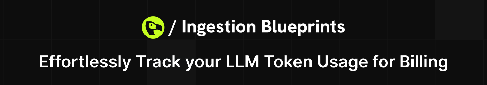

# Ingestion Blueprints

<p align="center">
  
</p>

<p align="center">
  <a href="https://www.npmjs.com/package/@dodopayments/ingestion-blueprints">
    
  </a>
  <a href="https://discord.gg/bYqAp4ayYh">
    
  </a>
  <a href="LICENSE">
    
  </a>
</p>

**Pre-built solutions to track usage and automate billing for your SaaS.** Track LLM tokens, API calls, storage uploads, streaming bandwidth, and compute time with just a few lines of code.

## Available Blueprints

- **[LLM Tracking](#llm-blueprint)** - Automatic token usage tracking for OpenAI, Anthropic, Groq, AI SDK, and more
- **[API Gateway](#api-gateway-blueprint)** - Track API calls and implement usage-based API billing
- **[Object Storage](#object-storage-blueprint)** - Monitor file uploads to S3, GCS, Azure Blob, and other storage services
- **[Stream](#stream-blueprint)** - Track streaming data consumption for video, audio, and live streams
- **[Time Range](#time-range-blueprint)** - Bill based on compute time for serverless functions, containers, and VMs

---

## LLM Blueprint

Track LLM token usage automatically for usage-based billing. Works with OpenAI, Anthropic, Groq, AI SDK, Google Gemini, and OpenRouter.

📖 **[Full Documentation](https://docs.dodopayments.com/developer-resources/ingestion-blueprints/llm)**

### Example
```javascript
import { createLLMTracker } from '@dodopayments/ingestion-blueprints';
import { generateText } from 'ai';
import { google } from '@ai-sdk/google';

const llmTracker = createLLMTracker({
  apiKey: process.env.DODO_PAYMENTS_API_KEY,
  environment: 'test_mode',
  eventName: 'your_meter_event_name'
});

const client = llmTracker.wrap({
  client: { generateText },
  customerId: 'customer_123'
});

const response = await client.generateText({
  model: google('gemini-2.0-flash'),
  prompt: 'Hello!',
  maxOutputTokens: 500
});

console.log(response.text);
console.log(response.usage);
// ✅ Usage automatically tracked to Dodo Payments!
```

---

## API Gateway Blueprint

Track API calls at the gateway level for usage-based API billing. Perfect for API-as-a-service platforms and multi-tenant SaaS.

📖 **[Full Documentation](https://docs.dodopayments.com/developer-resources/ingestion-blueprints/api-gateway)**

### Example
```javascript
import { Ingestion, trackAPICall } from '@dodopayments/ingestion-blueprints';

const ingestion = new Ingestion({
  apiKey: process.env.DODO_PAYMENTS_API_KEY,
  environment: 'test_mode',
  eventName: 'api_call'
});

// Track an API call
await trackAPICall(ingestion, {
  customerId: 'customer_123',
  metadata: {
    endpoint: '/api/v1/users',
    method: 'GET',
    status_code: 200,
    response_time_ms: 45
  }
});
```

---

## Object Storage Blueprint

Track file uploads and storage usage for S3, Google Cloud Storage, Azure Blob, and other object storage services.

📖 **[Full Documentation](https://docs.dodopayments.com/developer-resources/ingestion-blueprints/object-storage)**

### Example
```javascript
import { Ingestion, trackObjectStorage } from '@dodopayments/ingestion-blueprints';

const ingestion = new Ingestion({
  apiKey: process.env.DODO_PAYMENTS_API_KEY,
  environment: 'test_mode',
  eventName: 'object_storage_upload'
});

// Track S3 upload
await trackObjectStorage(ingestion, {
  customerId: 'customer_123',
  bytes: 1048576, // 1MB
  metadata: {
    bucket: 'my-bucket',
    key: 'uploads/document.pdf'
  }
});
```

---

## Stream Blueprint

Track streaming data consumption for video, audio, live streams, and real-time data transfer billing.

📖 **[Full Documentation](https://docs.dodopayments.com/developer-resources/ingestion-blueprints/stream)**

### Example
```javascript
import { Ingestion, trackStreamBytes } from '@dodopayments/ingestion-blueprints';

const ingestion = new Ingestion({
  apiKey: process.env.DODO_PAYMENTS_API_KEY,
  environment: 'test_mode',
  eventName: 'stream_consumption'
});

// Track video streaming
await trackStreamBytes(ingestion, {
  customerId: 'customer_123',
  bytes: 10485760, // 10MB
  metadata: {
    stream_type: 'video',
    quality: '1080p',
    duration_seconds: 30
  }
});
```

---

## Time Range Blueprint

Track resource consumption based on elapsed time for serverless functions, containers, VMs, and any time-based billing.

📖 **[Full Documentation](https://docs.dodopayments.com/developer-resources/ingestion-blueprints/time-range)**

### Example
```javascript
import { Ingestion, trackTimeRange } from '@dodopayments/ingestion-blueprints';

const ingestion = new Ingestion({
  apiKey: process.env.DODO_PAYMENTS_API_KEY,
  environment: 'test_mode',
  eventName: 'function_execution'
});

// Track function execution time
const startTime = Date.now();
await yourBusinessLogic();
const durationMs = Date.now() - startTime;

await trackTimeRange(ingestion, {
  customerId: 'customer_123',
  durationMs: durationMs,
  metadata: {
    function_name: 'image-processor',
    memory_mb: 512
  }
});
```

---

## Try the Examples

All blueprints come with runnable examples you can try immediately.

### Setup

1. **Clone and install**:
   ```bash
   git clone https://github.com/dodopayments/ingestion-blueprints.git
   cd ingestion-blueprints
   npm install
   npm run build
   ```

2. **Set up environment variables** in `examples/.env`:
    ```bash
    DODO_PAYMENTS_API_KEY=your_dodo_key_here
    OPENAI_API_KEY=your_openai_key_here
    ANTHROPIC_API_KEY=your_anthropic_key_here
    GROQ_API_KEY=your_groq_key_here
    GOOGLE_GENERATIVE_AI_API_KEY=your_google_key_here
    OPENROUTER_API_KEY=your_openrouter_api_key_here
    ```

3. **Run examples**:
   ```bash
   cd examples
   npm install

   # LLM examples
   npx tsx ai-sdk-example.ts
   npx tsx openai-example.ts
   npx tsx anthropic-example.ts
   npx tsx groq-example.ts
   npx tsx google-genai-example.ts
   npx tsx openrouter-example.ts

   # Other blueprint examples
   npx tsx api-gateway-example.ts
   npx tsx object-storage-example.ts
   npx tsx stream-example.ts
   npx tsx time-range-example.ts
   ```

---

## Why Use Ingestion Blueprints?

- **🚀 Quick Integration** - Get started in minutes with pre-built solutions
- **📊 Accurate Tracking** - Automatic usage capture with no manual logging
- **💰 Usage-Based Billing** - Convert usage directly into billing events
- **🔧 Flexible** - Track tokens, bytes, API calls, time, or custom metrics
- **🎯 Production-Ready** - Battle-tested, TypeScript support, minimal overhead
- **🌐 Universal** - Works with a variety of popular providers

**Perfect for:** SaaS platforms, AI applications, API services, streaming platforms, cloud compute billing.

---

## License

This project is licensed under the GNU General Public License v3.0 - see the [LICENSE](LICENSE) file for details.

## Contributing

Contributions are welcome! Please read our [Contributing Guide](CONTRIBUTING.md) for details on our code of conduct and the process for submitting pull requests.

## Security

Please report security vulnerabilities to security@dodopayments.com. See our [Security Policy](SECURITY.md) for more information.

## Support

- 📧 Email: support@dodopayments.com
- 💬 Discord: [Join our Discord](https://discord.gg/bYqAp4ayYh)
- 📖 Documentation: [Dodo Payments Docs](https://docs.dodopayments.com)